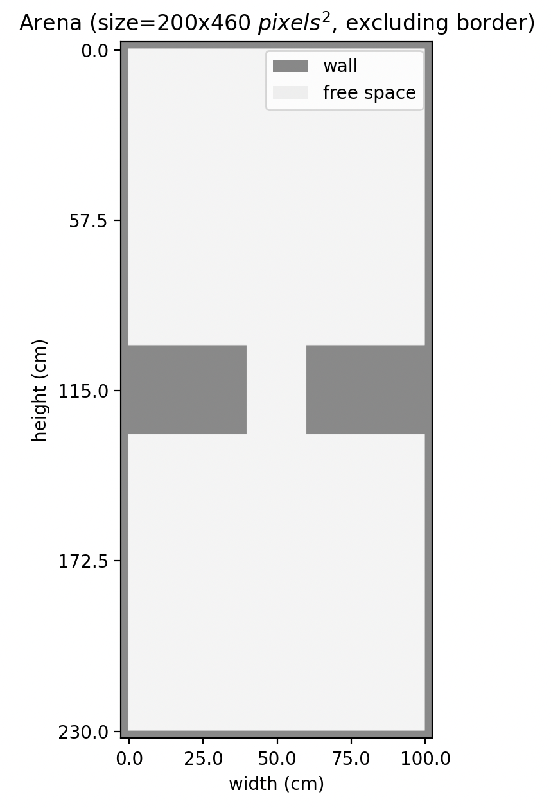
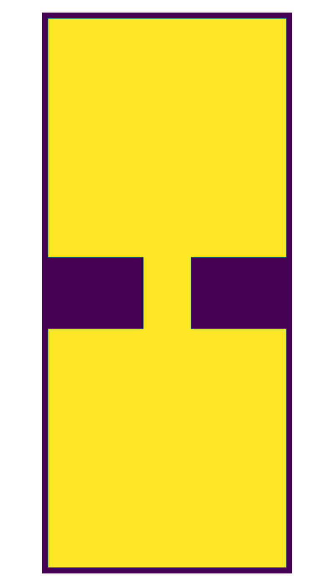
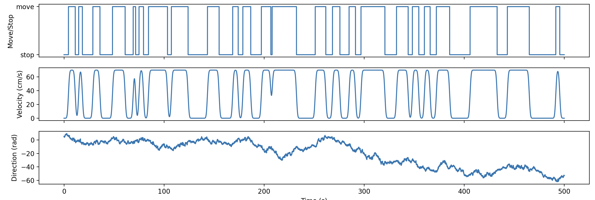
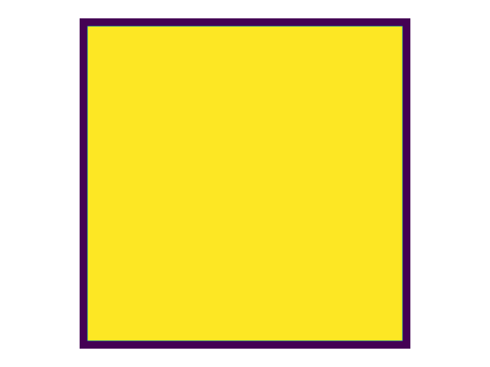

# RatatouGym: Spatial Navigation Gym

RatatouGym is a gymnasium environment for simulating spatial navigation in brains. It offers a comprehensive yet simple interface that integrates the simulation of environmental geometries, multiple sensory systems (modeled through their firing tunings), and diverse spatial traversal behaviors (such as random exploration with boundary avoidance).

## Documentation

The documentation is available at [here](https://ratatougym.github.io/).

## Installation

### Create a virtual environment
We recommend using conda to create a new environment.
```bash
conda create -n rtgym python=3.10
conda activate rtgym
```

### Install the package
```bash
git clone https://github.com/RatatouGym/rtgym.git
cd rtgym
pip install .  # For regular installation
# pip install -e .  # For editable/development installation
```

### Dependencies

RatatouGym automatically installs these core dependencies via pip:

- **NumPy** (≥1.20.0): Numerical computing
- **Matplotlib** (≥3.3.0): Plotting and visualization
- **PyTorch** (≥1.10.0): Deep learning framework
- **SciPy** (≥1.7.0): Scientific computing
- **scikit-learn** (≥1.0.0): Machine learning utilities
- **FAISS** (≥1.7.0): Efficient similarity search and clustering
- **PyYAML** (≥5.4.0): YAML parsing and generation
- **IPython** (≥7.0.0): Enhanced interactive Python shell

**Note:** For GPU acceleration, you may install `faiss-gpu` instead of `faiss-cpu`.

## Structure
- [Gym](#RatatouGym): `RatatouGym` class. The gym environment for spatial navigation tasks, it must contain an `Arena` and an `Agent`.
    - [Arena](#arena): The arena where the agent is placed in. It sets the shape of the arena. It can potentially add walls and obstacles. All the agent sensory and behavior is based on the shape of the arena (and the obstacles in it).
    - [Agent](#agent): The agent that is placed in the arena. It has a set of sensory and behavior. The sensory and behavior can be changed by the user.
        - [Sensory](#sensory): The sensory of the agent. It defines the observation of the agent.
        - [Behavior](#behavior): The behavior of the agent. It defines the action of the agent.

## Gym
The `RatatouGym` (spatial navigation gym) class. The gym environment for spatial navigation tasks, it must contain an `Arena` and an `Agent`. \[[Documentation](https://ratatougym.github.io/rtgym.html)\]

## Arena
The `Arena` class and its children classes. Define the shape of the arena. \[[Documentation](https://ratatougym.github.io/rtgym.arena.html)\]
<p align="center">
<picture></picture>
</p>

## Agent
`Agent` class. The agent that is placed in the arena. It has a set of sensory and behavior.

### Sensory
The `Sensory` class and its children classes. Define the sensories of the agent. It includes the spatial modulated sensories and movement modulated sensories \[[Documentation](https://ratatougym.github.io/rtgym.sensory.html)\]

### Behavior
Sometimes we need the agent to follow a behavior. The `Behavior` class and its children classes define the behaviors of the agent. <br>
Further improvement may required to describe mice movement patterns in the arena. \[[Documentation](https://ratatougym.github.io/rtgym.agent.behavior.html)\]

#### Random walk
<p align="center">
    <picture>
        
    </picture>
    <picture>
        
    </picture>
</p>

#### Random walk - random stopping
<p align="center">
<picture></picture>
</p>

## Citation

If you use RatatouGym in your research, please cite:

```bibtex
@inproceedings{WangTimeMakesSpace2024,
   title = {Time Makes Space: Emergence of Place Fields in Networks Encoding Temporally Continuous Sensory Experiences},
   author = {Wang, Zhaoze and Di Tullio, Ronald W. and Rooke, Spencer and Balasubramanian, Vijay},
   booktitle = {Advances in Neural Information Processing Systems (NeurIPS)},
   year = {2024},
   url= {https://arxiv.org/abs/2408.05798}
}

@inproceedings{WangREMI2025,
   title = {REMI: REconstructing Memory During Intrinsic Path Planning},
   author = {Wang, Zhaoze and Morris, Genela and Derdikman, Dori and Chaudhari, Pratik and Balasubramanian, Vijay},
   booktitle = {Advances in Neural Information Processing Systems (NeurIPS)},
   year = {2025},
   url = {https://arxiv.org/abs/2507.02064},
   eprint = {arXiv:2507.02064}
}
```

## License

RatatouGym is released under the MIT License. See the [LICENSE](LICENSE) file for details.

## Todo:
- [ ] Check the x,y coordinate system. Also the rotation of the arena. It seems its not very consistent across the project.
- [x] For the SM sensories and the MM sensories, it might be good to instead of putting all the different sensory sequences into a list, we could put them into a dictionary. This way we can easily access them by their name.
- [x] Remove the unused part of the behavior generator such as 'exploration' or 'action'.
- [x] ~~Fix the issue that velocity is 2D (so each velocity cell will be 2-dimensional).~~
- [ ] Add more realistic velocity cells.
- [ ] The direction and velocity cell need to have more variablities on the signal strength.
- [x] Make the batch to be the first dimension.
- [x] Replace yaml profile with json.
- [x] The sigma of the movement modulated signals are not invariant to the time_resolution.
- [ ] The sigma of the spatial modulated signals are not invariant to the spatial_resolution.
- [x] Make everything to be batch_first by default.
- [x] ~~Merge sm_responses and mm_responses~~ Duplicated todo, fixed below.
- [x] ~~Some structural changes are required. For instance, it might be good to return all responses as separate dictionary, rather than a pile of tensors.~~ Used multiple get methods to get the responses instead.
- [x] Deprecate the `RatatouGym.generate_data()` old method. Replace all response generation with seperate get methods.
- [x] Reimplement `RatatouGym.generate_trial()` such that it will only generate trial trajectory only. This saves a lot of time during data generation.
- [x] Remove the `batch_first` parameter. This has become hard to maintain. User can reshape after they generated the data.
- [x] Lift the `agent.behavior` level functions to the `agent` level to simplify the API.
- [x] ~~Implement `self.agent.sensory.get_responses()`, this will return all responses all together.~~ Moved this feature to `RatatouGym.get_responses()` -> `RatatouGym.trial.get_agent_responses()`.
- [x] Don't seperate spatial modulated and movement modulated responses.
- [x] Save trajectory data, also need a way to verify it its working in the same arena. Simple way is to add a verify function in the loader to make sure the trajectory is legal in the current arena_map.
- [x] The generated trial should be stored in the Trial object instead of being mixed with the agent object.
- [x] Responses can be get from a range of time steps.
- [ ] Lifting API might not be the best option, create a pile of duplicated code. Put them back and let user to create reference to the child object when calling the API instead.
- [ ] Might have flipped the dimension of the arenas, doesn't matter that much, but better to check. For rectangle, dimension 0 is height (when print), and dimension 1 is width. The upper right corner is the origin.
- [ ] The normalization of the neurons might be incorrect. Need to make sure it is at each neuron's level.
- [x] Arena map need to be flipped.
- [ ] The `print_specs()` method should not printing the maps.
- [x] The trajectory is a bit problematic. It will jump to some new location after the first time step.
- [x] Simplify the sensory responses and put repeated code into the base class.
- [x] Add visualization methods for movement modulated sensory responses.
- [ ] Add an Action module to the agent.
- [x] Lift the get sensory to trial level to separate the concerns.
- [ ] Add some kind of data class globally to store coordinates etc. Not sure how to do this yet. The data class itself is simple but not sure if it should be just a single point or a trajectory.
- [ ] Save and load trial in the format of `Trajectory` class.
- [ ] The displacement should have zero-value at the last time step such that its shape is consistent with the coordinate. This is already implementented but need to check if there are any deprecated code that is still assuming the T-1 shape (without the first time step).
- [ ] The magnitude of all movement_modulated signals are all scale-variant. Not an ideal design. Need to fix this.
- [x] ~~The velocity will resets to the base value periodically, need to check what happend.~~
- [ ] The above bug (velocity will resets to some base value) is fixed as it's primarily due to drift of the agent. Fixed it by double normalization. This is not efficient, need to refactor everything into radius. But just leave it for now to save time.
- [ ] The current design of the head-direction signals and velocity signals are poor representations. They aren't continuous.
- [x] Remove all 3D part of the code, it is making the project hard to manage.
- [x] For the sensory type map, automatically compile from the classes. Otherwise I'll have to manually update it every time I add a new sensory type.
- [x] The `seed` variable is removed, need to add an rng instead in the future. Currently I'm using save and load to ensure reproducibility.
- [ ] Consider parametrize the zero padding of acceleration and velocity (disps). I.e., along the time dimension, either [0s, values] or [values, 0s]. Both makes some sense. Currently I'm using [values, 0s] as it aligns the time step with the coordinate.
